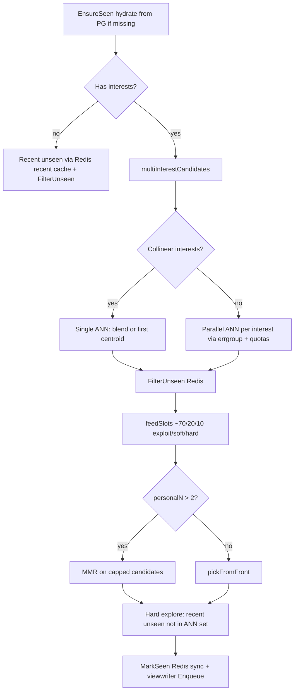

# AGENTS.md — Recommender Demo

Agent-facing project map for the current `perf/optimize-vector-updates` codebase. Prefer this over the short `README.md` when changing feed, Redis, or interaction write paths.

## What this is

Demo recommendation stack:

| Piece | Role |
|-------|------|
| **Postgres** | Durable users, posts, likes/dislikes, saves, shares, comments, bounded `post_views`, interaction weights |
| **Redis** | Hot preference vectors/interests, seen sets, engagement hashes, share memos, recent-post cache |
| **Qdrant** | Post embedding ANN (`posts` collection, dim 384) |
| **Embedding service** | `fastembed-go` BGESmallENV15 ONNX (`VECTOR_DIM=384`) |
| **Go API** | Chi REST server (`backend/cmd/server`) |
| **Nuxt UI** | Infinite-scroll feed + interactions panel (`frontend/`) |

Auth is demo-style: clients send `X-User-ID` (UUID). No real sessions.

---

## Quick start

```bash
make up                 # docker: postgres, redis, qdrant, embedding
make api                # Go API on :8090 (runs migrations, ensures Qdrant collection)
make seed               # JSON → Postgres + embed + Qdrant
make frontend           # Nuxt on :3000 (pnpm)
make test               # Custom metrics test suite (unit + integration + edge + light stress)
make test-stress-light  # Light load simulation (10 concurrent users fetching 1 feed + interacting)
make test-heavy         # Isolated heavy saturation stress test (200 concurrent users fetching 1 feed)
make test-go            # backend go test ./... (needs compose healthy)
```

Ports (host mappings from `docker-compose.yml` / `.env.example`):

| Service | Host port |
|---------|-----------|
| Go API | 8090 |
| Embedding | 8082 |
| Postgres | 5432 |
| Redis | **6380** (container 6379) |
| Qdrant HTTP | **6334** (container 6333) |
| Qdrant gRPC | 6335 |
| Nuxt | 3000 |

Env template: `.env.example`. Do not commit secrets from `.env`.

---

## Repo layout

```
backend/
  cmd/server/main.go          # wire DB, Redis, Qdrant, embed, viewwriter, interactionwriter
  internal/
    config/                   # all env knobs
    db/store.go               # Postgres CRUD + lists + MarkViewed retain
    handlers/                 # HTTP: feed, users, interactions, posts
    redisstore/               # vectors, interests, seen, eng, share memo, recent, DeleteUserKeys
    vector/                   # L2, cosine, multi-interest, MMR, quotas
    viewwriter/               # async bounded PG mark-viewed
    interactionwriter/        # async bounded PG like/save/share
    qdrantclient/             # search, get/upsert/delete points
    embedclient/              # HTTP embed
    migrate/                  # SQL migrations on boot
  migrations/001–010_*.sql
  scripts/scrub_test_data.go  # one-shot orphan cleanup (//go:build ignore)
  integration_test.go
frontend/
  app.vue                     # feed + delete user + interactions panel
  composables/useApi.ts       # API client + types
  composables/useUser.ts
embedding/                    # Docker embedding service
seed/                         # seed posts from JSON
docker-compose.yml
Makefile
```

---

## HTTP API

Router: `handlers.API.Routes()`.

| Method | Path | Notes |
|--------|------|-------|
| GET | `/health` | |
| GET | `/api/config` | Exposes feed/seen/writer knobs |
| GET | `/api/users` | |
| POST | `/api/users` | Body `{ "username": "..." }` |
| DELETE | `/api/users/{userID}` | Postgres delete (CASCADE) + Redis `DeleteUserKeys` |
| GET | `/api/me/interactions` | Requires `X-User-ID`; merges Redis hot + Postgres |
| GET | `/api/feed` | Requires `X-User-ID`; marks seen Redis-sync, PG async |
| POST/DELETE | `/api/posts/{postID}/like` | Redis eng + vector update + enqueue writer |
| POST/DELETE | `/api/posts/{postID}/dislike` | Same path as like (`is_like` flag) |
| POST/DELETE | `/api/posts/{postID}/save` | Redis eng + vector + enqueue |
| POST | `/api/posts/{postID}/share` | Deduped (Redis eng/memo + PG); vector only on first |
| GET/POST | `/api/posts/{postID}/comments` | **Still sync Postgres**; comments update vectors immediately |

CORS allows localhost:3000/3001; header `X-User-ID` required for user-scoped routes.

---

## Recommendation pipeline (current)

### Preference model

1. Interactions call `applyVector` → load post vector from Qdrant → `vector.ApplyInterest` on Redis `user:{id}:interests`.
2. Each interest is an L2-normalized centroid + mass weight. Cap `INTEREST_K` (default 5). New positive signal far from all centroids (cosine `< INTEREST_SIM_THRESHOLD`) spawns a new interest if `K` not full. Negatives only nudge closest centroid.
3. Blended legacy vector kept in sync: `user:{id}:vector` = `BlendInterests(...)`.
4. After every update, vectors are **L2-normalized** (unit length). Near-zero → skip / drop interest.

**Weights** (migration `008_retune_interaction_weights.sql`, live in `interaction_weights`):

| Type | Weight |
|------|--------|
| like | 1.0 |
| dislike | -0.8 |
| save | 1.5 |
| share | 1.4 |
| comment | 1.7 |

Shares are **deduped** per user/post (`shares` table + Redis eng/share memo) so one share does not stack preference updates.

### Feed (`GET /api/feed`)



**Slot mix** (`feed_slots.go`): ~70% exploit, ~20% soft explore (lower similarity half), ~10% hard explore (recent / non-ANN). For `FEED_LIMIT >= 5`, soft and hard are at least 1 each.

**Cold start**: no interests → recent unseen only (Redis `posts:recent` cache → Postgres fallback).

**MMR**: `vector.MMR` with `MMR_LAMBDA`; candidate list capped by `MMR_CANDIDATE_CAP`. Skipped when personalized slot count ≤ 2.

**ANN collapse**: `ShouldCollapseInterests` if ≤1 active interest or all pairwise cosines ≥ `INTEREST_COLLINEAR_MIN` → one Qdrant search instead of K.

### Seen / views

- **Hot**: Redis SET `user:{id}:seen` with TTL `SEEN_TTL`. Hydrate from last `SEEN_HYDRATE_LIMIT` PG views (clamped ≤ `VIEW_RETAIN_LIMIT`).
- **Durable**: `viewwriter` workers call `MarkViewed` with retain limit.
- **Bounded rows**: keep last N `post_views` per user; older rows deleted and folded into `posts.view_count` (migration `010`).

### Engagement writes (likes / dislikes / saves / shares)

Pattern: **Redis-hot + async durable** (same idea as views).

1. Update Redis eng hash immediately (likes: `"1"`/`"0"`/`"x"` tombstone; saves/shares: active/`"x"`).
2. Update preference interests synchronously (still on request path).
3. Enqueue `interactionwriter.Job` → Postgres upsert/delete. Queue full → drop (best-effort demo).
4. **Comments remain synchronous** Postgres + vector update.

**List reads** (`GET /api/me/interactions`): merge Redis hashes over Postgres lists; tombstones hide PG rows until flush; fill missing titles from PG.

### Delete user

1. `DELETE FROM users` — FK CASCADE clears likes/saves/comments/shares/`post_views`.
2. `Redis.DeleteUserKeys`: vector, interests, seen, eng hashes, scan-delete `user:{id}:shared:*`.

---

## Redis key map

| Key | Purpose |
|-----|---------|
| `user:{id}:vector` | Blended L2 preference vector (legacy / debug) |
| `user:{id}:interests` | JSON multi-interest centroids |
| `user:{id}:seen` | SET of seen post IDs |
| `user:{id}:eng:likes` | HASH postID → `1`/`0`/`x` |
| `user:{id}:eng:saves` | HASH postID → `1`/`x` |
| `user:{id}:eng:shares` | HASH postID → `1` (and tombstone if used) |
| `user:{id}:shared:{postID}` | Share memo TTL key |
| `posts:recent` | Cached recent post ID list |

Helpers: `make flush` (FLUSHALL), `make flush-prefs` (wipe vector/interests/seen patterns — eng keys may need separate cleanup).

---

## Config knobs (defaults)

From `backend/internal/config/config.go` / `.env.example`:

| Env | Default | Effect |
|-----|---------|--------|
| `FEED_LIMIT` | 5 | Posts per feed page |
| `QDRANT_OVERFETCH` | 50 | ANN / recent over-fetch |
| `INTEREST_K` | 5 | Max centroids |
| `INTEREST_SIM_THRESHOLD` | 0.55 | Spawn new interest if best cosine below this |
| `INTEREST_COLLINEAR_MIN` | 0.9 | Collapse multi-ANN when interests align |
| `MMR_LAMBDA` | 0.7 | Relevance vs diversity |
| `MMR_CANDIDATE_CAP` | 30 | Cap MMR input size |
| `SEEN_TTL` | 72h | Seen SET TTL |
| `SEEN_HYDRATE_LIMIT` | 50 | PG → Redis hydrate (≤ retain) |
| `VIEW_RETAIN_LIMIT` | 1000 | Max `post_views` rows per user |
| `VIEW_WRITE_WORKERS` / `QUEUE_SIZE` | 8 / 4096 | Async view durability |
| `INTERACTION_WRITE_WORKERS` / `QUEUE_SIZE` | 8 / 4096 | Async like/save/share durability |
| `SHARE_MEMO_TTL` | 24h | Skip duplicate share PG checks |
| `RECENT_CACHE_TTL` / `SIZE` | 30s / 100 | Hard explore / cold start |

---

## Frontend (current)

- **Nuxt 3** + pnpm; API base `NUXT_PUBLIC_API_BASE`.
- User picker: create / select / **delete user**.
- After create or user change: `resetFeedAndLoad` refreshes feed immediately.
- Side **interactions panel**: likes, dislikes, saves, shares, comments via `/api/me/interactions`; debounced refresh after actions (`scheduleIxRefresh`).
- Infinite scroll feed; engagement buttons call post endpoints with `X-User-ID`.

---

## Postgres schema (migrations)

| File | Content |
|------|---------|
| `001_users` | users |
| `002_posts` | posts (+ later `view_count`, share counters as evolved) |
| `003_interaction_weights` | weights seed |
| `004_likes` | likes (`is_like`) |
| `005_saves` | saves |
| `006_comments` | comments |
| `007_post_views` | post_views |
| `008_retune_interaction_weights` | L2-era weights |
| `009_shares` | per-user share dedupe table |
| `010_post_view_retain` | `posts.view_count` + index for trim |

User delete relies on `ON DELETE CASCADE` from `users`.

---

## Testing conventions

- Integration and package tests expect Docker services up (`make test`).
- **Cleanup**: register `t.Cleanup` for users/posts/Redis/Qdrant. Close the DB pool with `t.Cleanup(func(){ store.Pool.Close() })` **after** other cleanups — `defer store.Pool.Close()` runs before `t.Cleanup` and breaks DB/Redis wipe.
- Helpers: `db.DeleteUser`, `DeletePost(s)`, `qdrantclient.DeletePoints`, `redisstore.DeleteUserKeys` / `DeleteSeenKey`.
- Orphan scrub: `cd backend && go run ./scripts/scrub_test_data.go`.

---

## Evolution vs original exploit-only feed

Shipped on this branch (rough chronological intent):

1. **L2 normalize** preference updates + retuned weights.
2. **Share dedupe** (no stacked share preference).
3. **70/20/10** exploit / soft / hard explore slots.
4. **Multi-interest** centroids + **MMR** diversity.
5. **Redis-hot seen** + **viewwriter** async durable views.
6. Perf: share memo, recent cache, collinear ANN collapse, parallel ANN, MMR cap, early-stop in `ApplyInterest`, bounded `post_views` + `view_count`.
7. **Delete user** (PG + Redis), **interactions list** API + UI, **interactionwriter** Redis-hot likes/saves/shares.
8. Test cleanup order + scrub script.

**Explicitly out of scope / not implemented:** trending score, popularity ranking, randomized cold-start vectors (discussed; not shipped).

---

## Agent working rules for this repo

1. **Match existing patterns**: Redis-hot + bounded async writer for high-QPS durable side effects; keep vector updates on the request path unless redesigning intentionally.
2. **Do not edit plan files** the user attaches unless asked; implement from the plan.
3. **Commits**: only when asked; detailed messages; user often requests **no** `Co-authored-by: Cursor` trailer (strip if the environment adds it).
4. **Frontend package manager**: pnpm (`Makefile` / lockfile). README still mentions npm in places — prefer pnpm.
5. **Avoid unbounded Postgres growth** for per-user event tables; prefer last-N + counters (see views).
6. **Comments** are sync by design today; changing them to async needs eng merge + writer kind + UI refresh semantics.
7. Prefer extending `config.Load` + `.env.example` + `GetConfig` together when adding knobs.
8. Keep Qdrant point IDs aligned with Postgres post UUIDs.

---

## Key source files to open first

| Concern | File |
|---------|------|
| Feed + interactions HTTP | `backend/internal/handlers/handlers.go`, `interactions.go`, `feed_slots.go` |
| Multi-interest / MMR math | `backend/internal/vector/interests.go`, `mmr.go`, `vector.go` |
| Redis hot state | `backend/internal/redisstore/*.go` |
| Durable store | `backend/internal/db/store.go` |
| Async writers | `viewwriter/writer.go`, `interactionwriter/writer.go` |
| Wiring | `backend/cmd/server/main.go` |
| UI | `frontend/app.vue`, `composables/useApi.ts` |

---

## Known caveats

- Async writers can **drop** jobs when the queue is full (demo load shedding).
- Redis eng tombstones can temporarily hide PG rows on list merge until the delete flush lands.
- `make flush-prefs` does not wipe eng/share-memo keys; delete-user path does.
- README ports for Redis/Qdrant/embedding are slightly outdated vs compose/`.env.example` — trust compose + config defaults.
- Branch tip historically includes test-cleanup and interaction features; check `git log --oneline` before assuming remote state.
